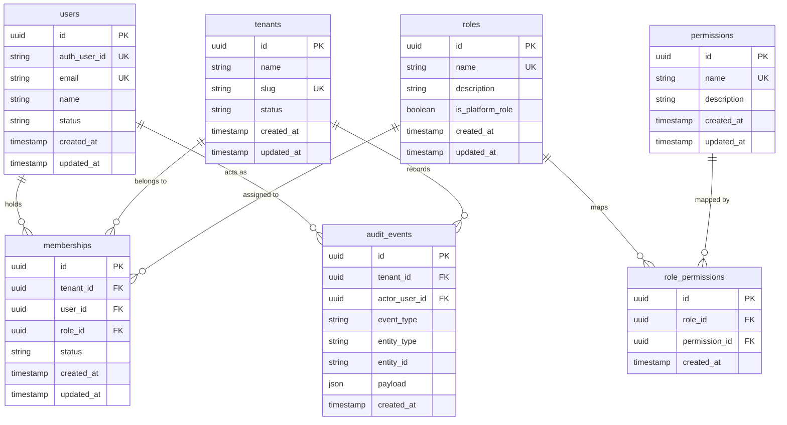

# Database: Phase 1 Schema & Migration Specification

## Migration Strategy

- **Tooling**: Alembic manages all schema revisions.
- **Production Execution**: Schema is migrated using versioned migrations (`alembic upgrade head`), never runtime `create_all()`.
- **Primary Migration**: `0001_phase1` (`backend/migrations/versions/0001_phase1_identity_and_tenancy.py`).
- **Engines Supported**:
  - PostgreSQL 16 (production baseline, running via Docker Compose).
  - SQLite (supported for isolated local testing).

---

## Entity Relationship Diagram

---

## Table Specifications & Constraints

### 1. `users`
- `id`: UUID, Primary Key
- `auth_user_id`: VARCHAR(255), Unique, Indexed, Non-null (Supabase Auth UID)
- `email`: VARCHAR(255), Unique, Indexed, Non-null
- `name`: VARCHAR(255), Nullable
- `status`: VARCHAR(50), Default `'ACTIVE'`, Non-null
- `created_at`: TIMESTAMPTZ, Default `NOW()`, Non-null
- `updated_at`: TIMESTAMPTZ, Default `NOW()`, Non-null

### 2. `tenants`
- `id`: UUID, Primary Key
- `name`: VARCHAR(255), Non-null
- `slug`: VARCHAR(100), Unique, Indexed, Non-null
- `status`: VARCHAR(50), Default `'ACTIVE'`, Non-null (`ACTIVE`, `SUSPENDED`, `INACTIVE`)
- `created_at`: TIMESTAMPTZ, Default `NOW()`, Non-null
- `updated_at`: TIMESTAMPTZ, Default `NOW()`, Non-null

### 3. `roles`
- `id`: UUID, Primary Key
- `name`: VARCHAR(100), Unique, Indexed, Non-null
- `description`: VARCHAR(255), Nullable
- `is_platform_role`: BOOLEAN, Default `FALSE`, Non-null
- `created_at`: TIMESTAMPTZ, Default `NOW()`, Non-null
- `updated_at`: TIMESTAMPTZ, Default `NOW()`, Non-null

### 4. `permissions`
- `id`: UUID, Primary Key
- `name`: VARCHAR(100), Unique, Indexed, Non-null
- `description`: VARCHAR(255), Nullable
- `created_at`: TIMESTAMPTZ, Default `NOW()`, Non-null
- `updated_at`: TIMESTAMPTZ, Default `NOW()`, Non-null

### 5. `role_permissions`
- `id`: UUID, Primary Key
- `role_id`: UUID, Foreign Key (`roles.id` ON DELETE CASCADE), Indexed, Non-null
- `permission_id`: UUID, Foreign Key (`permissions.id` ON DELETE CASCADE), Indexed, Non-null
- `created_at`: TIMESTAMPTZ, Default `NOW()`, Non-null
- **Constraint**: `UNIQUE (role_id, permission_id)` (`uq_role_permission`)

### 6. `memberships`
- `id`: UUID, Primary Key
- `tenant_id`: UUID, Foreign Key (`tenants.id` ON DELETE CASCADE), Indexed, Non-null
- `user_id`: UUID, Foreign Key (`users.id` ON DELETE CASCADE), Indexed, Non-null
- `role_id`: UUID, Foreign Key (`roles.id` ON DELETE RESTRICT), Indexed, Non-null
- `status`: VARCHAR(50), Default `'ACTIVE'`, Non-null (`ACTIVE`, `SUSPENDED`, `INACTIVE`)
- `created_at`: TIMESTAMPTZ, Default `NOW()`, Non-null
- `updated_at`: TIMESTAMPTZ, Default `NOW()`, Non-null
- **Constraint**: `UNIQUE (tenant_id, user_id)` (`uq_tenant_user_membership`)

### 7. `audit_events`
- `id`: UUID, Primary Key
- `tenant_id`: UUID, Foreign Key (`tenants.id` ON DELETE CASCADE), Indexed, Nullable (NULL for platform events)
- `actor_user_id`: UUID, Foreign Key (`users.id` ON DELETE SET NULL), Indexed, Nullable
- `event_type`: VARCHAR(100), Indexed, Non-null
- `entity_type`: VARCHAR(100), Nullable
- `entity_id`: VARCHAR(100), Nullable
- `payload`: JSON, Default `'{}'`, Non-null
- `created_at`: TIMESTAMPTZ, Default `NOW()`, Non-null

---

## Seed Data Initialization

Revision `0001_phase1` seeds the following initial dataset:

### Initial Roles
- `PLATFORM_ADMIN` (`is_platform_role = true`)
- `PLATFORM_SUPPORT` (`is_platform_role = true`)
- `TENANT_OWNER` (`is_platform_role = false`)
- `TENANT_ADMIN` (`is_platform_role = false`)
- `TENANT_MEMBER` (`is_platform_role = false`)
- `TENANT_VIEWER` (`is_platform_role = false`)

### Initial Permissions
- `tenant.read`, `tenant.manage`
- `membership.read`, `membership.manage`
- `role.read`, `role.manage`
- `user.read`, `user.manage`
- `audit.read`

Seed reliability is maintained via `RoleService.seed_defaults()`, which can also run idempotently during test and startup lifecycles.
